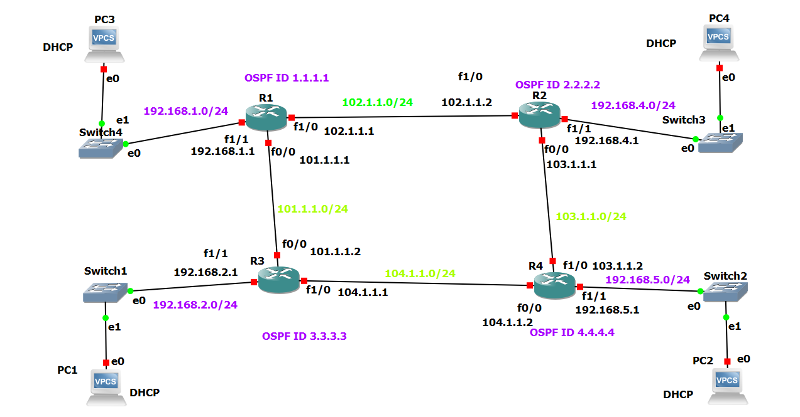

# OSPF DHCP Lab
This was a class project in the Spring 2025 semester completed by Brian Wei (me). This network was simulated using GNS3 in Windows, with the GNS3VM in VMware.

This is an OSPF network with four routers (R1, R2, R3, R4). All routers are in one OSPF Area 0 and it uses Process ID 1, with MD5 authentication. Each router serves a LAN subnet using DHCP and it's connected through switches. In this project, connectivity throughout the network was proved by using pings.

**OSPF** (Open Shortest Path First) is a convenient method for routers to know the state of the network. **DHCP** allows IP addresses to be automatically assigned to a PC.

## Repo structure
* **images**: Folder that contains images for this ReadMe

* **router-configs**: Folder that contains how I configured the four routers

* **Project Screenshots.pdf**: Contains screenshots for topology, pings from all four PCs, and OSPF databases from all four routers

* **README.md**: This file. Contains brief overview of the lab

## Features
* The topology contains four routers, four PCs, and four switches

* There are four LAN subnets:
  * 192.168.1.0/24
  * 192.168.2.0/24
  * 192.168.4.0/24
  * 192.168.5.0/24

* There are four inter-router links which are used to help PCs communicate with each other. Given that PCs are located far away from each other, these are important. The IPs for these links are:
  * R1 and R2 → 102.1.1.0/24
  * R1 and R3 → 101.1.1.0/24
  * R3 and R4 → 104.1.1.0/24
  * R2 and R4 → 103.1.1.0/24

* OSPF Router IDs are used to identify each router in the OSPF domain:
  * R1 → OSPF ID 1.1.1.1
  * R2 → OSPF ID 2.2.2.2
  * R3 → OSPF ID 3.3.3.3
  * R4 → OSPF ID 4.4.4.4

* The routers' different interfaces have their own IPs. For example, R1 has:
  * f0/0 → 101.1.1.1
  * f1/0 → 102.1.1.1
  * f1/1 → 192.168.1.1

* All four routers have a passive interface setting. This prevents unnecessary OSPF communications towards the switches and PCs. 

* Each router has a DHCP pool configured. This means that each router is acting as the DHCP server for its subnet. Whenever a PC connects through the switch to the router, an IP address is obtained automatically from the DHCP pool.

* Each router has an OSPF database, and it contains what the network looks like

More information can be found in the router config files, topology, and other project screenshots.